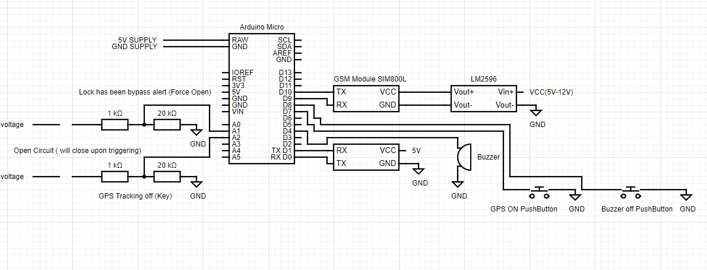

# Bike SmartLock

## Steps to Setup Bike SmartLock
1. Clone this repository 
```
git clone https://github.com/pd1drone/SmartLock
```
2. Get the TinyGPS folder and copy it to the folder libraries it is located the arduino codes has been save it will have a libraries folder. The default folder of arduino is in /Documents/Arduino/libraries/  


3. Setup the Schematic Diagram Below


4. After setting up the Schematic Diagram Open the VendingMachine.ino file in arduino and then upload.

5. Adjust number of recipient in line 11
```
String number = "+639264562589"; //-> change with your number
```
## Format of SMS Command
### To get the current coordinates of the Bike SmartLock send message as:
```
Send current location
```

